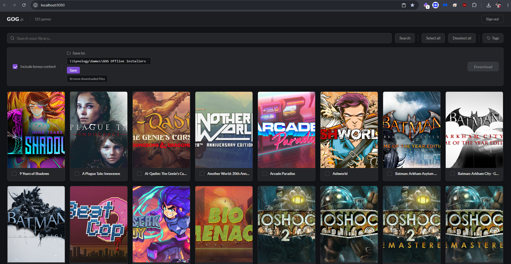
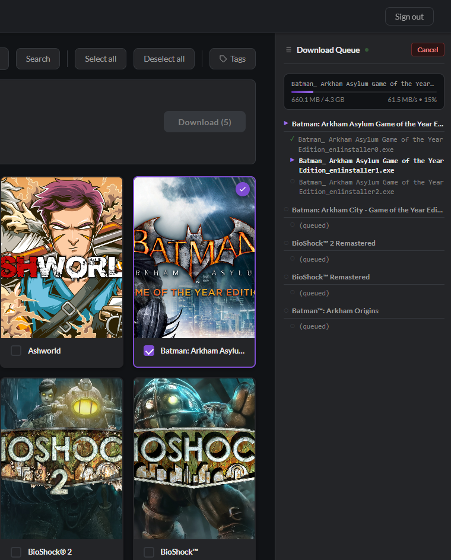

# GOG Offline Library Downloader

**Your GOG games, downloaded and ready to keep.**

GOG Offline Library Downloader is a portable Windows app primarily designed to automatically download offline installers from your [GOG.com](https://www.gog.com/) library to a place you control. Sign in, choose your games and a download folder, and let the app collect the files for you.

Keep your fully owned games on a local drive, external drive, or network storage so your offline installers are available whenever you need them. Shared storage makes those files accessible from any device that can access it; installing and playing a game still requires a compatible operating system and hardware.

### What it does

- Browse and search your GOG library in a cover grid.
- Select games and automatically download their offline installers, with optional bonus content.
- Save files to your chosen folder, organized by game.
- Follow the download queue with a progress bar, download speed, and file status.
- Run the app on your own Windows PC, with a browser interface.

### Browse your library

Search for a game, select the titles you want to keep offline, and choose where to save them. Use **Include bonus content** to download extras alongside your installers.



---

### Quick start

1. Download and unzip `GOG-Downloader.zip`.
2. Double-click **`GOG-Downloader.exe`**.
3. A purple **G** icon appears in the system tray (bottom-right of the taskbar). Your browser opens automatically to `http://localhost:8080`.
4. Log in to GOG (see below), select games, and click **Download**.

To quit the app, right-click the tray icon and choose **Exit**.  
To reopen the browser at any time, double-click the tray icon or choose **Open Browser**.

---

### How to log in to GOG

1. On the login screen, click **Open GOG login**. A new tab to `auth.gog.com` opens.
2. Sign in with your GOG account.
3. After login you land on a mostly blank `embed.gog.com` page. Copy the **entire URL** from the address bar (<kbd>Ctrl+L</kbd> then <kbd>Ctrl+C</kbd>).
4. Go back to the downloader tab:
   - Click **Paste URL & Login** to let the app read the URL from your clipboard, or
   - Paste the URL into the text box and click **Submit**.
5. The page switches to your library. Search, select games, and start downloads. Use **Sign out** in the top-right corner when you are done.

---

### Changing the download folder

The **Save to** field in the download options bar shows the current download location. Type any absolute path (e.g. `D:\Games\GOG`) and click **Save** (or press <kbd>Enter</kbd>). The folder is created automatically if it does not exist. The setting persists across restarts.

Default location: `%USERPROFILE%\Downloads\GOG`

### Follow your downloads

Click **Download** after selecting your games. The **Download Queue** sidebar shows the current file's progress, downloaded size, and speed, along with completed files and games waiting in the queue. Use **Cancel** to stop the download job.



---

### Privacy and security

The app runs on your computer and connects to GOG to sign you in, load your library, and download your files. Its browser interface is available on **localhost** only (`127.0.0.1`), and your GOG session stays **in memory** while the app runs.

The OAuth **client id / secret** in the repo are GOG’s **public** client values, not your account password. See [SECURITY.md](SECURITY.md) for the full policy, reporting process, and deployment notes.

---

### Building from source

Requirements: **Node.js 20+**, **Python 3.11+**, and **pip** on your `PATH`.

```powershell
git clone https://github.com/treysl/GOG-Downloader.git
cd GOG-Downloader
.\build.ps1
```

The script:
1. Runs `npm install && npm run build` inside `frontend/`.
2. Runs `pip install -r requirements.txt`.
3. Packages everything with PyInstaller.

Output is in `dist\GOG-Downloader\`. Zip that folder to share.

---

### Running in development (no build required)

**Backend:**
```powershell
cd backend
pip install -r ..\requirements.txt
$env:DOWNLOAD_PATH = "$env:USERPROFILE\Downloads\GOG"
uvicorn main:app --host 127.0.0.1 --port 8080 --reload
```

**Frontend** (in a second terminal):
```powershell
cd frontend
npm install
npm run dev   # Vite dev server on http://localhost:5173 with proxy to :8080
```
